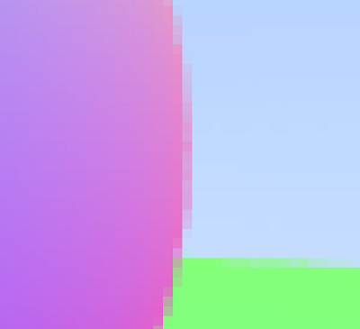

# Learning Rust Part 5: Materials

> 📚 Series: [Part 1](https://github.com/lopossumi/Rust-Hello) - [Part 2](https://github.com/lopossumi/Rust-Output-Image) - [Part 3](https://github.com/lopossumi/Rust-Vectors) - [Part 4](https://github.com/lopossumi/Rust-Rays) - [Part 5](https://github.com/lopossumi/Rust-Materials)

In the [previous session](https://github.com/lopossumi/Rust-Rays) we created some rays and colored two spheres with normal vectors. Now let's add some materials to our spheres.

## Random number generation and anti-aliasing

First, we need a random number generator. There is no such thing in the standard library, so let's import the ```rand``` crate. It comes with a [comprehensive set of documentation](https://rust-random.github.io/book/guide-start.html), where in the very first example it is stated that:

> The first thing you may have noticed is that we imported everything from the prelude. This is the lazy way to use rand, and like the standard library's prelude, only imports the most common items. If you don't wish to use the prelude, remember to import the Rng trait!

Lazy way sounds great! After adding a random number generator and moving the camera to its own file, our main program averages a bunch of rays for a single pixel:
```rust
// main.rs
...
    let mut rng = thread_rng();
    for (x, y, pixel) in buffer.enumerate_pixels_mut() {
        let mut color: Color = Color::new(0.0, 0.0, 0.0);
        for _s in 0..SAMPLES_PER_PIXEL {
            let rand_x: f64 = rng.gen(); // value range 0.0..1.0
            let rand_y: f64 = rng.gen();
            let u = (rand_x + x as f64) / (IMAGE_WIDTH - 1) as f64;
            let v = 1.0 - (rand_y + y as f64) / (IMAGE_HEIGHT - 1) as f64;
            let ray = camera.get_ray(u, v);
            color = color + ray.color(&world);
        }
        color = color / SAMPLES_PER_PIXEL as f64;
        *pixel = Rgb(color.to_rgb());
    }
```
With 5 samples the edges look really jagged:


With 50 samples everything is a lot smoother (while taking 10 times as long):



So how long is that, and what can we do about it?

## Optimization

There are a few benchmarking tools for Rust, but let's start with a simple timer and a print statement to the error output:
```rust
    let start = std::time::Instant::now();
    // Do heavy stuff
    eprintln!("Elapsed: {:?}", start.elapsed());
```
```
PS D:\RustProjects\materials> cargo run
Elapsed: 9.5592981s
Done.
```
With 50 samples the rendering takes 9.6 seconds on a Ryzen 3400G. Not great, not terrible.

But wait, we are running it in debug mode. How about if we switch to release?
```
PS D:\RustProjects\materials> cargo run --release
Elapsed: 246.4353ms
Done.
```
We get almost a 40x speedup for free, just by remembering to use the right compiler flag!

Upping the resolution to 1920 x 1080, it takes 6.2 seconds on average to render two balls with 50 samples per pixel:
```
PS D:\RustProjects\materials> cargo run --release
Elapsed: 6.3509268s
Done.
```
Maybe the image buffer is slowing us down? Let's move the rendering to its own file, create our own 2D array of ```Color``` structs first, and then the image:
```rust
pub fn render(
    camera: &Camera,
    world: &HittableList,
    image_width: u32,
    image_height: u32,
    samples: u32,
) -> RgbImage {
    let mut colors: [[Color; image_width]; image_height];
```
```
> Executing task: cargo build <

   Compiling materials v0.1.0 (D:\RustProjects\materials)
error[E0435]: attempt to use a non-constant value in a constant
  --> src\render.rs:15:30
   |
15 |     let mut colors: [[Color; image_width]; image_height];
   |                              ^^^^^^^^^^^ non-constant value
```
Even though ```image_width``` is constant, the compiler can't know it (because we *could* pass in any ```u32``` value) and thus arrays are out of the question. Let's try vectors instead.

A two-dimensional vector sounds like a mess of pointers, but how about a ```Vec<Color>``` and some smart indexing?
```rust
    let colors: Vec<Color> = (0..image_height * image_width)
        .into_iter()
        .map(|index| {
            let x = index % image_width;
            let y = index / image_width;

            // return Color at (x, y)
        })
        .collect();

    for (x, y, pixel) in buffer.enumerate_pixels_mut() {
        let index: usize = (y * image_width) as usize + x as usize;
        let color = colors.get(index).unwrap();
        *pixel = Rgb(color.to_rgb());
    }
```
```
PS D:\RustProjects\materials> cargo run --release
Elapsed: 6.121465s
Done.
```
No change. But now that we have an iterator in the mix, we can just throw more cores at the problem with [rayon](https://crates.io/crates/rayon). This is so easy it feels like cheating - just switch ```into_iter``` with ```into_par_iter```:
```rust
use rayon::iter::{IntoParallelIterator, ParallelIterator};
...
    let colors: Vec<Color> = (0..(image_height * image_width))
        .into_par_iter()
        .map(|index| {
            let x = index % image_width;
            let y = index / image_width;

            // return Color at (x, y)
        })
        .collect();
```
```
PS D:\RustProjects\materials> cargo run --release
Elapsed: 1.2618604s
Done.
```
With 1000 samples:
```
PS D:\RustProjects\materials> cargo run --release
Elapsed: 24.0086908s
Done.
```
How about changing all the doubles to floats - half the size, twice the speed? Not quite, but still worth doing:
```
PS D:\RustProjects\materials> cargo run --release
Elapsed: 19.3472669s
Done.
```
Another 20% shaved. The original 384 pixel wide image takes just 40ms to render, and we're done for now.

## Diffuse spheres

I was able to implement [lambertian reflection](https://raytracing.github.io/books/RayTracingInOneWeekend.html#diffusematerials/truelambertianreflection) without much difficulties. One thing to note is that now that the program is multi-threaded, we need to be a bit more careful with e.g. random number generation: I opted to create the ```thread_rng``` inside the parallel loop, and to borrow it around within scope.


## Materials

TODO: Write me!